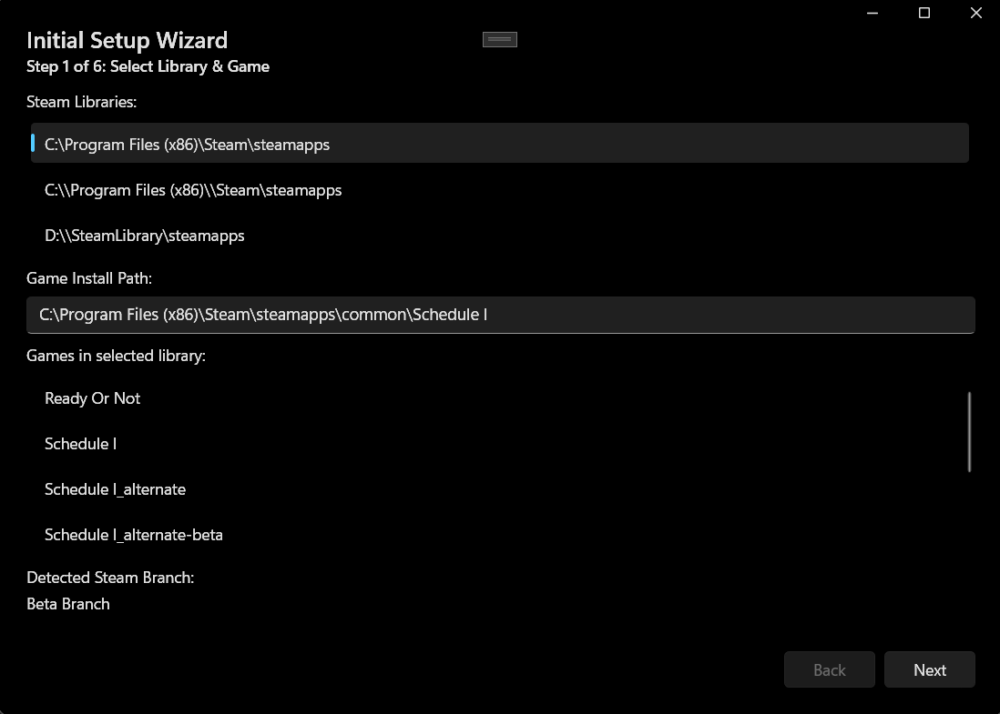
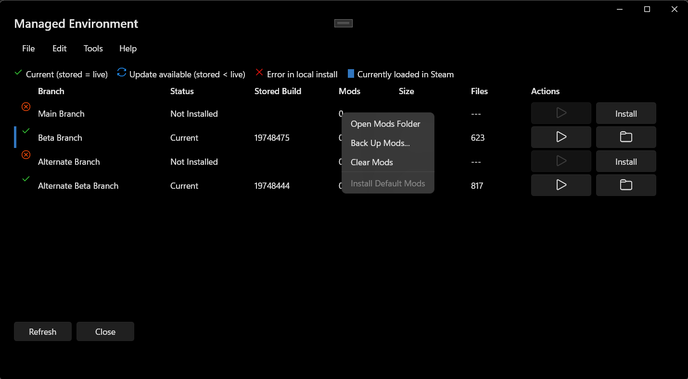

# Schedule I Developer Environment Utility (WinUI 3 + MVVM)

A Windows desktop utility that creates and manages a separate, versioned “managed environment” for the game Schedule I. It streamlines copying installed branches into isolated folders, tracks build IDs using Steam appmanifest snapshots, and provides quality-of-life tools for launching, mod management, logs, and notifications.

This app is a modernized, WinUI 3 + MVVM rework of the legacy Windows Forms “Schedule I Development Environment Manager” (see references/README). Functionality is largely equivalent but with an updated flow, UI, and implementation.

## Key Features
- **Setup Wizard:** Guided flow to select the Steam library, detect the game, choose a managed environment path, and pick branches to manage.
- **Managed Environment:** Central view of all supported branches with status, actions, and quick access.
- **Branch-first Copy:** Copies the currently installed Steam branch first; prompts for branch switch only when required.
- **Build Tracking:** Saves the Steam `appmanifest_<appId>.acf` into each branch folder; uses it as the source of truth for the stored build ID.
- **Mods Management:** Per-branch Mods/Plugins folders with runtime-specific default mods:
  - `Default Mods/Il2Cpp/{Mods,Plugins}` used by main/beta branches
  - `Default Mods/Mono/{Mods,Plugins}` used by alternate branches
  - Context menu to install default mods into the selected branch.
- **Logs + Notifications:** In-app UI logs, auto-scrolling; Windows notifications when copy completes.
- **Polished UX:** Dark theme, standardized controls, aligned layout, subtle row highlight for current Steam branch.

## How It Works
- **Detect:** Reads Steam installation and libraries; infers current installed branch from the game’s Steam appmanifest.
- **Plan:** Wizard builds a copy plan based on selected branches, prioritizing the branch currently installed in Steam.
- **Copy:** Background copy of game files into `<ManagedEnv>/branches/<branch>` while skipping `Mods` and `Plugins` folders. On completion, copies the Steam appmanifest into the branch folder for stored build ID comparisons.
- **Status:** For each branch, shows whether it’s installed and if an update is available. For the currently installed Steam branch, compares stored vs live build IDs to surface “Update Required”. Other branches default to “Current” unless errors are detected.
- **Manage Mods:** Right‑click a branch → Install Default Mods. The app copies files from runtime‑specific default locations into the branch’s `Mods` and `Plugins`.

## Supported Branches and Runtimes
- **Il2Cpp:** `main-branch`, `beta-branch`
- **Mono:** `alternate-branch`, `alternate-beta-branch`

Runtime determines which Default Mods subfolders are used during “Install Default Mods.” Mods built for one runtime won’t work for the other.

## Managed Environment Layout
- `<ManagedEnv>/branches/<branch>`: A complete copy of the game for that branch
- `<ManagedEnv>/logs`: App and copy logs
- `<ManagedEnv>/temp`: Temporary working files
- `<ManagedEnv>/Default Mods`:
  - `Il2Cpp/Mods` and `Il2Cpp/Plugins`
  - `Mono/Mods` and `Mono/Plugins`
- `<ManagedEnv>/backups`: Zip archives created by “Back Up Mods...”

Each branch folder contains:
- `Schedule I.exe` and game content copied from Steam
- `appmanifest_<appId>.acf` copied from Steam’s `steamapps` to track the stored build ID
- `Mods` and `Plugins` folders (not copied from Steam; managed per branch)

## App Flow
1. **Startup:** If a configuration exists, opens Managed Environment; otherwise, starts the Setup Wizard.
2. **Wizard Steps:**
   - Library & Game selection (auto‑detection supported)
   - Managed environment path selection and validation
   - Branch selection
   - Branch switch step (only if the next branch to copy isn’t currently installed in Steam)
   - Copy step (background copy + logs + toast)
   - Summary
3. **Managed Environment:** Shows all branches with status, actions, and mods tools.

## UI Actions (Managed Environment)
- **Install:** Creates a headless wizard for that branch using saved paths; prompts only for branch switching if needed.
- **Play:** Launches the branch’s `Schedule I.exe` when present.
- **Open:** Opens the branch folder in Explorer.
- **Mods column:**
  - Open Mods Folder / Clear Mods / Back Up Mods
  - Install Default Mods (enabled when runtime‑appropriate defaults exist)

## Screenshots
- Location: `Assets/Screenshots/`

Setup Wizard
- 
- 
- 
- 
- 

Managed Environment
- 

Tips
- Capture at 125–150% scaling for readability; crop unnecessary chrome.
- Prefer PNG for UI static shots; GIF/MP4 for flows (commit large videos via links if needed).

## Requirements
- Windows 10/11
- .NET 8 SDK
- Windows App SDK 1.6.x
- Steam client installed
- Schedule I installed via Steam

## Build & Run
- Restore: `dotnet restore`
- Build: `dotnet build "Schedule I Developer Environment Utility.sln"`
- Run (CLI): `dotnet run --project "Schedule I Developer Environment Utility.csproj"`
- Publish (profile): `dotnet publish -c Release -p:PublishProfile=Properties/PublishProfiles/win-x64.pubxml`
- Publish (self-contained): `dotnet publish -c Release -r win-x64 --self-contained`

Open in Visual Studio 2022+ with the Windows App SDK workload for a full designer/debug experience.

## Configuration & Paths
- **Config file:** `%USERPROFILE%\AppData\LocalLow\TVGS\Development Environment Manager\config.json`
- **Managed structure:** `<ManagedEnv>/branches/<branch>`, `logs/`, `temp/`, `Default Mods/`, `backups/`
- **Branch manifest:** `appmanifest_<appId>.acf` copied into each branch folder to track the stored build ID

## Contributing
- **Style:** Follow C# conventions; nullable enabled; async suffix `Async`; minimal code‑behind (favor MVVM).
- **Commits:** Conventional Commits (e.g., `feat(services): add branch parsing`).
- **PRs:** Include a clear description, linked issues, screenshots/GIFs for UI changes, and validation steps. Update docs (`README.md`, `AGENTS.md`) when behavior or architecture changes.
- **Scope:** Keep changes focused; avoid unrelated refactors.
- **Security:** Don’t commit secrets or local AppData artifacts. Avoid logging PII. Respect user paths and permissions.

## Architecture & Code Map
- `App.xaml` / `App.xaml.cs`: App bootstrap, DI/service registration, startup flow (wizard vs manager), toast setup.
- Views: `SetupWizardWindow.xaml`, `ManagedEnvironmentWindow.xaml` (+ code‑behind for UI wiring only).
- ViewModels: `ViewModels/SetupWizardViewModel.cs`, `ViewModels/ManagedEnvironmentViewModel.cs`.
- Models: `Models/DevEnvironmentConfig.cs`, `Models/BranchInfo.cs` (status, display, runtime helpers), and related data objects.
- Services: `Services/SteamService.cs` (Steam paths/manifest parsing), `Services/ConfigurationService.cs` (config, branch validation), `UiLogService` + logging providers, theme helpers.

Key behaviors:
- Copy excludes `Mods` and `Plugins` from Steam install to keep managed mods isolated.
- Manifest snapshot copied to the branch folder is used to compute stored build IDs.
- Status for non‑current branches defaults to “Current” unless validation errors exist.

## Development Tips
- If you see XAML build errors, ensure Windows App SDK 1.6.x is installed and NuGet restore succeeds.
- The wizard’s copy runs off the UI thread; UI updates are marshaled to the UI thread.
- Notifications use `AppNotificationManager`; ensure app identity is available or expect silent fallback in dev.
- Default Mods runtime folders are auto‑scaffolded during Save in the Wizard.

## Similar/Legacy Project
This app supersedes the legacy Windows Forms tool “Schedule I Development Environment Manager.” For conceptual parity and prior behavior, see:
- `references/Schedule I Development Environment Manager/README.md`

## FAQ
- **Why not copy Mods/Plugins from the Steam install?**
  - Mods differ per runtime and are user‑managed; the tool keeps them isolated per managed branch.
- **What triggers “Update Required”?**
  - When the stored build (from the branch’s saved appmanifest) is older than the live build in Steam for the currently installed branch.
- **Can I add default plugins?**
  - Yes. Place files into `Default Mods/<Runtime>/Plugins`. The “Install Default Mods” action copies both Mods and Plugins.

## License
See LICENSE.txt in the references project as a historical reference. A formal license for this repository can be added if/when provided by the project owners.
